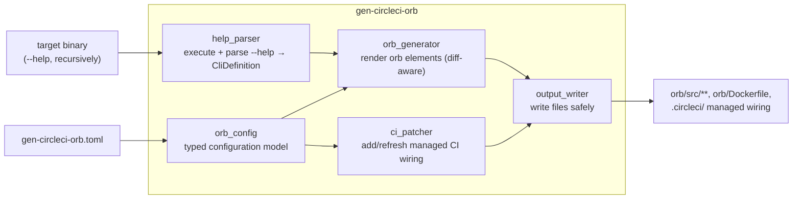

<!--
SPDX-FileCopyrightText: 2026 jerusdp

SPDX-License-Identifier: MIT OR Apache-2.0
-->

# Architecture

A high-level map of how gen-circleci-orb is put together. For the detailed design, rationale, and
worked examples, see the [design document](design.md).

## What it does, in one line

Read a clap-based CLI's `--help`, build a structured model of its commands, and render a complete
CircleCI orb (and optionally the CI wiring to keep that orb in sync with the binary).

## Crate layout

This is a Cargo workspace with a single library-plus-binary crate,
`crates/gen-circleci-orb` (`src/lib.rs` → library `gen_circleci_orb`, `src/main.rs` → binary
`gen-circleci-orb`). Keeping the logic in a library makes it testable and lets the binary stay a
thin CLI shell.

## Pipeline

## Modules (`crates/gen-circleci-orb/src/`)

| Module | Responsibility |
|--------|----------------|
| `help_parser/` | Executes `<binary> --help` and each `<binary> <subcommand> --help` recursively, and parses the (clap) output into a typed `CliDefinition` (`help_parser/types.rs`). Best-effort for non-clap help. |
| `orb_config/` | The typed configuration model persisted in `gen-circleci-orb.toml` — namespaces, install method, orb-tools version, which workflows to wire, MCP options, and the environment-variable names used for signing/push. |
| `orb_generator/` | Walks the `CliDefinition` + config and renders the orb elements — commands, jobs, executor, `@orb.yml`, Dockerfile. Diff-aware: files are only rewritten when their content changes. |
| `ci_patcher/` | Adds and refreshes the **managed** blocks in a consumer's `.circleci/` wiring (the `update --check` / `update` flow that keeps the orb self-reference and generated jobs current). |
| `output_writer/` | Writes generated files to disk safely, refusing to clobber unrecognised files unless forced, and honouring `--dry-run`. |
| `commands/` | One module per subcommand, orchestrating the above: `init`, `generate`, `update`, `config`, `ensure_orb_registered`. |

## Subcommands

| Subcommand | Purpose |
|------------|---------|
| `init` | Interactively capture the workflow into `gen-circleci-orb.toml` and lay down the initial orb + CI wiring. |
| `generate` | (Re)generate the orb from the binary's current `--help`. Optionally records/commits/pushes the result. |
| `update` | Re-sync the managed CI wiring to the current generator flow; `--check` verifies without writing (used as a CI gate). |
| `config` | Inspect/manage the configuration. |
| `ensure-orb-registered` | Ensure the orb is registered in the CircleCI registry before publishing. |

## External interactions

- **Process execution** — runs the target binary (`--help`), `git`, and the `circleci` CLI as
  subprocesses. Because it executes the target binary, only trusted binaries should be used (see
  [assurance-case.md](assurance-case.md)).
- **Git & network** — uses `git2`/libgit2 and the `pcu` library for repository discovery, GPG-signed
  commits, and pushing regenerated orbs over HTTPS.
- **Its own orb** — the project dogfoods gen-circleci-orb to generate the orb published from this
  repository (`orb/`), so the managed CI wiring here is itself generated output.

## Key design properties

- **Language-agnostic model.** The `CliDefinition` decouples parsing from generation, so the
  generator does not depend on the source CLI's language or build system.
- **Diff-aware, idempotent generation.** Re-running produces no changes when nothing has changed
  (covered by the `generate_is_idempotent` integration test), keeping regeneration commits clean.
- **Reviewable, verifiable output.** Generated artefacts are committed as reviewable diffs and
  validated in CI (orb pack/review, and `update --check`).

For deeper detail — the command model, subcommand→orb-element mapping, parameter type inference,
namespace handling, and the release pipeline — see the [design document](design.md).
