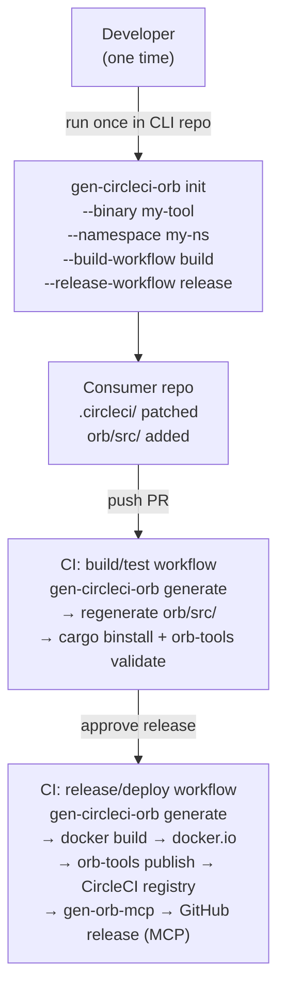
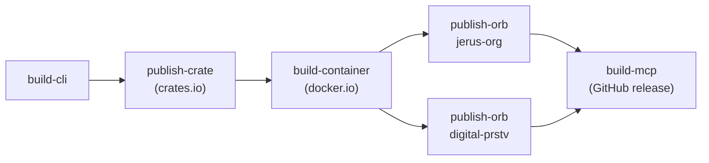
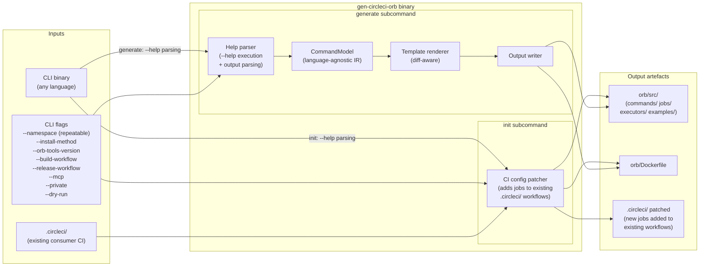

# gen-circleci-orb — Design Document

> Status: **DRAFT** — design decisions recorded; roadmap items deferred.

---

## 1. Purpose

`gen-circleci-orb` eliminates the repetitive work of packaging a CLI tool as a CircleCI orb.
It introspects the CLI's `--help` output and generates the full suite of orb artefacts: jobs,
commands, executor, Dockerfile, and CI pipeline — then wires those artefacts into the CLI tool's
existing CI configuration so they are regenerated and published automatically on every release.

### 1.1 Two operational modes

| Mode | How gen-circleci-orb is consumed | Primary interface |
|------|----------------------------------|-------------------|
| **Orb-only** | Consumer references the published orb directly in their `.circleci/config.yml` | Help text in the orb jobs/commands guides the consumer through manual wiring |
| **CLI + Orb** | Consumer installs the CLI and runs `init` once | `init` command rewrites the consumer's CI config automatically; subsequent runs happen in CI |

The CLI mode is the preferred path for first-party tools (where the developer controls the source
repo). The orb-only mode covers third-party tools or consumers who cannot or prefer not to install
the CLI.

### 1.2 Generated artefacts

| Artifact | Description |
|----------|-------------|
| CircleCI orb | Jobs, commands, and a default executor derived from the CLI's subcommand tree, stored in `orb/src/` within the CLI tool's own repository |
| Executor | Default executor referencing the tool's Docker image; can be substituted with a custom executor provided it has the same CLI version installed |
| Docker container | A Dockerfile co-located with the orb source; built and published to docker.io as part of the release pipeline |
| CI workflow fragments | Build/test and release/deploy jobs added to the consumer's existing `.circleci/` config (not a replacement — additive wiring only) |
| MCP server | Post-publish invocation of `gen-orb-mcp` producing an MCP server for AI agent integration (optional, enabled by `--mcp` flag on `init`) |

### 1.3 Primary usage model

`gen-circleci-orb` runs as part of the CLI tool's release pipeline. Each release regenerates the
orb from the current `--help` output, rebuilds the container, and republishes to the CircleCI
registry. The `init` command wires this up once; the developer never needs to author CI YAML for
the orb directly.

The tool makes no assumptions about the source language or build system of the target CLI. Its
only requirement is a runnable binary.

> **Bootstrapping note:** The MCP server step depends on `gen-orb-mcp` being available as a
> published orb. For gen-circleci-orb's own first release this creates a sequencing dependency —
> the gen-orb-mcp orb must be published first. See §4.8 for the bootstrapping sequence.

---

## 2. Motivation

Packaging a CLI tool as a CircleCI orb is repetitive work: every tool needs the same executor
definition, the same job/command boilerplate, the same container build pipeline, and the same
release wiring. The pattern is identical across tools; only the command names, parameters, and
binary name differ.

`gen-circleci-orb` eliminates this repetition by treating the orb as a derived artefact of the
CLI's own `--help` output.

Secondary motivation: orbs published without a corresponding MCP server are invisible to AI coding
agents. By including `gen-orb-mcp` in the release chain, every generated orb ships with
first-class agent support from the first release.

---

## 3. High-Level Flow

### 3.1 CLI mode (init + CI)



### 3.2 Orb-only mode

Consumer references the published orb and wires jobs manually. The orb's job descriptions
include integration guidance explaining which jobs to add to which workflows and what contexts
are required.

---

## 4. Example Application

`gen-orb-mcp` is a CLI tool that generates MCP servers from CircleCI orb definitions. It has five
subcommands discovered by running `gen-orb-mcp --help`:

```
Commands:
  generate  Generate an MCP server from an orb definition
  validate  Validate an orb definition without generating
  diff      Compute conformance rules by diffing two orb versions
  migrate   Apply conformance-based migration to a consumer's .circleci/ directory
  prime     Populate prior-versions/ and migrations/ from git history
```

A developer wanting to expose `gen-orb-mcp` via CircleCI runs:

```bash
gen-circleci-orb generate \
  --binary gen-orb-mcp \
  --namespace jerus-org \
  --namespace digital-prstv \
  --output ./gen-orb-mcp-orb
```

`gen-circleci-orb` executes `gen-orb-mcp --help`, `gen-orb-mcp generate --help`,
`gen-orb-mcp validate --help`, etc., parses the output, and produces:

### 4.1 Generated orb entry point

```yaml
# gen-orb-mcp-orb/src/@orb.yml
version: 2.1
description: >
  Generate MCP servers from CircleCI orb definitions.
display:
  home_url: https://github.com/jerus-org/gen-orb-mcp
  source_url: https://github.com/jerus-org/gen-orb-mcp-orb
commands:
  generate: { ref: "commands/generate.yml" }
  validate: { ref: "commands/validate.yml" }
  diff:     { ref: "commands/diff.yml" }
  migrate:  { ref: "commands/migrate.yml" }
  prime:    { ref: "commands/prime.yml" }
jobs:
  generate: { ref: "jobs/generate.yml" }
  validate: { ref: "jobs/validate.yml" }
  diff:     { ref: "jobs/diff.yml" }
  migrate:  { ref: "jobs/migrate.yml" }
  prime:    { ref: "jobs/prime.yml" }
executors:
  default: { ref: "executors/default.yml" }
```

### 4.2 Generated orb command (example: `generate`)

Derived from `gen-orb-mcp generate --help` output. All leaf-level subcommands become commands.

```yaml
# gen-orb-mcp-orb/src/commands/generate.yml
description: Generate an MCP server from an orb definition.
parameters:
  orb_path:
    type: string
    description: "Path to the orb YAML file (e.g., src/@orb.yml)"
  output:
    type: string
    default: "./dist"
    description: "Output directory for generated server"
  format:
    type: enum
    default: "source"
    enum: ["binary", "source"]
    description: "Output format"
  name:
    type: string
    default: ""
    description: "Name for the generated orb server (defaults to filename)"
  version:
    type: string
    default: ""
    description: "Version for the generated MCP server crate"
  force:
    type: boolean
    default: false
    description: "Overwrite existing files without confirmation"
  migrations:
    type: string
    default: ""
    description: "Directory containing conformance rule JSON files to embed"
  prior_versions:
    type: string
    default: ""
    description: "Directory of prior orb version YAML snapshots to embed"
  tag_prefix:
    type: string
    default: "v"
    description: "Tag prefix used to discover the orb version from git tags"
steps:
  - run:
      name: gen-orb-mcp generate
      command: |
        gen-orb-mcp generate \
          --orb-path "<< parameters.orb_path >>" \
          --output "<< parameters.output >>" \
          --format "<< parameters.format >>" \
          <<# parameters.name >>--name "<< parameters.name >>"<</ parameters.name >> \
          <<# parameters.version >>--version "<< parameters.version >>"<</ parameters.version >> \
          <<# parameters.force >>--force<</ parameters.force >> \
          <<# parameters.migrations >>--migrations "<< parameters.migrations >>"<</ parameters.migrations >> \
          <<# parameters.prior_versions >>--prior-versions "<< parameters.prior_versions >>"<</ parameters.prior_versions >>
```

### 4.3 Generated orb job (example: `generate`)

All commands have a corresponding job one level up that wraps checkout + the command.

```yaml
# gen-orb-mcp-orb/src/jobs/generate.yml
description: Run gen-orb-mcp generate in a dedicated job.
executor: default
parameters:
  orb_path:
    type: string
  output:
    type: string
    default: "./dist"
  # ... same parameters as command ...
steps:
  - checkout
  - generate:
      orb_path: << parameters.orb_path >>
      output: << parameters.output >>
```

**Relationship to circleci-toolkit jobs:** The generated jobs are intentionally minimal —
`checkout` + command invocation only. The `circleci-toolkit` jobs for complex Rust builds layer
additional scaffolding on top: GPG key loading, git config, build caching, SSH deploy keys, and
Rust-specific steps (clippy, fmt, audit). A consumer repo that already uses `circleci-toolkit`
would typically invoke the generated orb's *commands* from within a toolkit job, rather than
replacing toolkit jobs with generated jobs wholesale. The generated job structure is the correct
baseline for tools that don't require that scaffolding (e.g. a read-only code analysis tool).

### 4.4 Generated executor

```yaml
# gen-orb-mcp-orb/src/executors/default.yml
description: Execution environment with gen-orb-mcp pre-installed.
docker:
  - image: jerusdp/gen-orb-mcp:<< parameters.tag >>
parameters:
  tag:
    type: string
    default: latest
```

### 4.5 Generated Dockerfile (embedded in orb repo)

```dockerfile
FROM ubuntu:24.04
RUN cargo binstall --no-confirm gen-orb-mcp
```

### 4.6 Full release pipeline (generated `.circleci/release.yml`)

The generated release workflow orchestrates the complete chain from CLI build to MCP publication:

```
1. build-cli       → cargo build --release
2. publish-crate   → cargo publish → crates.io          (Rust tools)
3. build-container → docker build → docker.io
4. publish-orb     → orb-tools publish → CircleCI registry (one job per namespace)
5. build-mcp       → gen-orb-mcp prime + generate + compile → GitHub release asset
```



### 4.7 Dogfooding: gen-circleci-orb generating its own orb

The primary validation target is gen-circleci-orb itself. Once the tool has a `generate`
subcommand, it generates its own orb:

```bash
gen-circleci-orb generate \
  --binary gen-circleci-orb \
  --namespace jerus-org \
  --output ./gen-circleci-orb-orb
```

This creates a reference implementation demonstrating what the tool produces and serves as a
continuous integration test: the orb must stay consistent with the CLI's actual `--help` output.

**Bootstrapping sequence for the first release:**

The generated release pipeline for gen-circleci-orb invokes `gen-orb-mcp` to build the MCP
server. For this to work, `gen-orb-mcp` must already be available as a published orb. The
required sequence is:

1. Build and release gen-circleci-orb v0.x (initial release, MCP step omitted or manual)
2. Use gen-circleci-orb to generate the gen-orb-mcp orb → publish it
3. Wire the gen-orb-mcp orb into gen-circleci-orb's own release pipeline
4. Subsequent gen-circleci-orb releases use the fully automated chain

This mirrors the current situation where pcu (the "mega-tool") provides release-pipeline
services that gen-circleci-orb will eventually replace or encapsulate via generated orbs.

### 4.8 User workflow (CLI mode, step by step)

```
1. Install gen-circleci-orb CLI
   cargo binstall gen-circleci-orb

2. Run init once in the CLI tool's repository
   gen-circleci-orb init \
     --binary my-tool \
     --namespace my-org \
     --build-workflow build \
     --release-workflow release \
     --mcp                        # optional: wire in MCP generation
   
   init:
   - Adds orb/src/ scaffold to the repo
   - Adds a Dockerfile alongside orb/src/
   - Patches .circleci/config.yml to add build+test jobs (generate, validate)
   - Patches .circleci/release.yml (or equivalent) to add release jobs
     (generate, docker build/push, orb publish, optional MCP build)

3. Push changes as a PR
   The revised CI script is reviewed and merged via the normal PR workflow.

4. CI (build workflow) runs on the merged PR branch
   - gen-circleci-orb generate regenerates orb/src/ from --help output
   - orb-tools validate confirms the orb is well-formed
   - Changes are committed back to the branch (diff-aware: no commit if nothing changed)

5. Trigger release/deploy workflow
   - gen-circleci-orb generate (regenerate to ensure freshness)
   - docker build → push to docker.io
   - orb-tools publish → CircleCI registry (one job per namespace)
   - gen-orb-mcp → MCP server binary → uploaded to GitHub release (if --mcp was set)

6. Artefacts published
   - Container image: docker.io/<org>/<binary>:<version>
   - Orb: circleci.com/developer/orbs/orb/<namespace>/<binary>
   - MCP server: GitHub release asset on the CLI tool's repo
```

### 4.9 Environment requirements for initial release

The following external services must be configured before the generated CI pipeline can run
successfully. All credentials are expected as CircleCI context environment variables.

| Service | Purpose | Required credentials |
|---------|---------|---------------------|
| **GitHub** | Source control, GitHub releases (MCP asset upload), API access for pcu push | `GITHUB_TOKEN` or GitHub App credentials (`APP_ID`, `APP_PRIVATE_KEY`) |
| **docker.io** | Container image registry | `DOCKER_USERNAME`, `DOCKER_PASSWORD` (or equivalent) |
| **CircleCI orb registry** | Orb publishing (public or private namespace) | `CIRCLE_TOKEN` with orb publish scope |
| **crates.io** | Binary publishing (Rust CLIs only) | `CARGO_REGISTRY_TOKEN` |

**Access visibility:**
- Orbs can be published as **public** (visible at circleci.com/developer/orbs) or **private**
  (visible only within the CircleCI organisation). The `--private` flag on `init` controls this.
- The generated container image on docker.io is public by default. Private registries are a
  roadmap item.

**Minimum viable environment (MVP):**
GitHub + CircleCI orb registry. docker.io and crates.io are required only if the consumer uses
the container executor and publishes to crates.io respectively.

---

## 5. Architecture Overview



### 5.1 Help parser

Executes the target binary with `--help` to obtain the top-level command list and description,
then executes `<binary> <subcommand> --help` for each discovered subcommand, recursively. Produces
a normalised `CommandModel` regardless of the source CLI's language or build system. MVP targets
clap's help output format; best-effort mode applies to non-clap CLIs (see §6.2).

### 5.2 CommandModel

A language-agnostic intermediate representation:

```
CommandModel
├── binary_name: String
├── description: String
└── commands: Vec<Command>
    ├── name: String
    ├── description: String
    ├── is_leaf: bool          // true = generates command; false = generates job only
    ├── parameters: Vec<Parameter>
    │   ├── long_name: String  // e.g. "orb-path" → parameter name "orb_path"
    │   ├── short: Option<char>
    │   ├── param_type: ParamType  // String | Boolean | Enum(Vec<String>) | Integer
    │   ├── default: Option<String>
    │   ├── required: bool
    │   └── description: String
    └── subcommands: Vec<Command>   // recursive
```

### 5.3 Subcommand → orb element mapping

| CLI level | Orb element generated | Rationale |
|-----------|----------------------|-----------|
| Leaf subcommand (no children) | `commands/<name>.yml` | Maximum flexibility for composing custom jobs |
| Parent of leaf subcommands | `jobs/<name>.yml` (wraps its leaf commands) | Jobs provide the checkout + environment; leaf commands provide the steps |
| Top-level binary | `executors/default.yml`, `@orb.yml` | One executor per tool |

For a flat CLI (all subcommands are leaves, e.g. `gen-orb-mcp`), every subcommand gets both a
command and a job.

For a nested CLI (e.g. `tool server start`, `tool server stop`):
- `start` and `stop` → `commands/server_start.yml`, `commands/server_stop.yml`
- `server` → `jobs/server.yml` (with `action` enum parameter: `[start, stop]`)

*Future:* A custom job specification feature will allow users to define jobs that combine multiple
commands or add custom steps not derivable from the CLI structure.

### 5.4 Parameter type inference

Inferred from clap's structured help output:

| Signal in `--help` text | Inferred CircleCI type |
|------------------------|----------------------|
| `[possible values: a, b, ...]` | `enum` with listed values |
| Flag has no `<VALUE>` metavar (boolean presence flag) | `boolean` |
| `[default: <value>]` present | type inferred from default; adds `default:` to parameter |
| Metavar `<PATH>`, `<DIR>`, `<FILE>`, `<OUTPUT>` | `string` |
| All other cases | `string` (safe fallback) |

### 5.5 Template renderer

Walks the `CommandModel` and renders all output files. Diff-aware: files are only written if their
rendered content differs from the existing file, minimising noisy commits on regeneration runs.
`--dry-run` prints the diff without writing.

### 5.6 Output writer

Writes to `--output <dir>`. Fails on unrecognised existing files unless `--force` is passed.
On greenfield runs (empty output dir) prompts for `--orb-tools-version` if not supplied.
On brownfield runs (existing orb dir) reads the version from the existing `.circleci/config.yml`
unless explicitly overridden.

---

## 6. Detailed Design

### 6.1 Container installation method

Controlled by `--install-method <method>`:

| Method | Generated Dockerfile snippet | When to use |
|--------|------------------------------|-------------|
| `binstall` (default) | `RUN cargo binstall --no-confirm <name>` | Rust tool published to crates.io with binstall metadata |
| `apt` | `RUN apt-get install -y <name>` | Binary available in apt package repository |

Both methods install into a base image selected by `--base-image` (default: `ubuntu:24.04`).
The Dockerfile is embedded directly in the orb repo alongside the orb source; no separate
container repository is generated.

Additional install methods (GitHub release download, Homebrew, etc.) are deferred to the roadmap.

### 6.2 Help format handling

The parser targets clap's `--help` output format as the MVP baseline. Clap produces stable,
structured output including `[possible values: ...]` annotations, consistent flag/argument
formatting, and grouped sections.

For non-clap CLIs, a best-effort parser applies: it extracts subcommands and flags using
heuristics (indentation, leading `--`, presence of description text) but may miss type
information. In best-effort mode all parameters default to `type: string`.

### 6.3 Namespace publishing

`--namespace` is required and repeatable. Each namespace produces a separate `publish-orb-<ns>`
job in the generated release workflow. The orb name is always `<namespace>/<binary-name>`.

```bash
# Single namespace
gen-circleci-orb generate --binary gen-orb-mcp --namespace jerus-org --output ./out

# Multiple namespaces (parallel publish jobs)
gen-circleci-orb generate --binary gen-orb-mcp \
  --namespace jerus-org \
  --namespace digital-prstv \
  --output ./out
```

### 6.4 Diff-aware regeneration

On each run the renderer compares generated content against existing files:

1. Files with changed content → overwritten
2. Files with identical content → skipped (no write, no git change)
3. Files present in output but not in the new render → flagged as stale (not deleted by default;
   `--prune` removes them)

This keeps regeneration commits minimal and reviewable.

### 6.5 orb-tools version

Exposed as `--orb-tools-version <version>`. Behaviour:

- **Greenfield** (no existing `.circleci/`): required; prompted interactively if not supplied
- **Brownfield** (existing `.circleci/`): read from the current config and preserved unless
  explicitly overridden with `--orb-tools-version`

The version is embedded in the generated `.circleci/config.yml` as a pipeline parameter with a
default value, making future upgrades a one-line change.

### 6.6 MCP server generation (post-publish)

The generated `release.yml` includes a `build-mcp` job that runs after all `publish-orb-*` jobs
complete. It mirrors the `toolkit/build_mcp_server` job pattern:

1. `gen-orb-mcp prime` — populate `prior-versions/` and `migrations/` from git tag history
2. `gen-orb-mcp generate --format binary` — compile the MCP server binary
3. Upload binary to the GitHub release as an asset

This is the same pattern currently used by the `circleci-toolkit` orb itself.

---

## 7. Design Decisions

| # | Question | Decision |
|---|----------|----------|
| 1 | Subcommand → orb mapping | Leaf subcommands → commands; parents of leaves → jobs. Future: custom job specification feature. |
| 2 | Container install method | `cargo binstall` default; `apt` option. Others deferred to roadmap. |
| 3 | Container scope | Dockerfile embedded in the consumer's repo alongside `orb/src/`. No separate container repository. |
| 4 | Release pipeline | Full chain: CLI build → crates.io → docker.io → CircleCI registry (per namespace) → GitHub release (MCP binary). MVP targets these four registries/repositories. |
| 5 | MCP server placement | Post orb publish in CI (Option A). Mirrors `toolkit/build_mcp_server` pattern. Optional at `init` time via `--mcp`. |
| 6 | Namespace | `--namespace` flag, required, repeatable. Generates one publish job per namespace. |
| 7 | Regeneration | Diff-aware. Only changed files are written; `--prune` removes stale files. |
| 8 | orb-tools version | Exposed as `--orb-tools-version`. Prompted on greenfield; preserved from existing config on brownfield. |
| 9 | Help format | MVP targets Rust/clap. Best-effort mode for non-clap CLIs (all params default to `string`). |
| 10 | First validation target | gen-circleci-orb dogfoods itself. The generated orb for the `generate` subcommand is the reference implementation and continuous integration test. |
| 11 | Primary interface | `init` subcommand for one-time wiring into existing consumer CI; `generate` subcommand for subsequent CI-driven regeneration. Orb-only mode (no CLI install) provides guidance via job descriptions. |
| 12 | Orb source location | Generated orb source lives in `orb/src/` within the CLI tool's own repo. CI commits regenerated files back to the branch (diff-aware: no commit if unchanged). No separate orb repository is created. |
| 13 | CI config modification strategy | `init` patches the consumer's existing `.circleci/` files additively — it adds new jobs to named workflows but does not replace or restructure existing CI. The consumer specifies which workflows receive build/test jobs and which receive release/deploy jobs. |
| 14 | Orb visibility | `--private` flag on `init` controls whether the published orb is public (default) or private to the CircleCI organisation. |
| 15 | Environment requirements | MVP targets: GitHub (source + releases), docker.io (container), CircleCI registry (orb). crates.io optional (Rust CLIs). All credentials supplied via CircleCI contexts. |

---

## 8. Roadmap (Deferred Items)

| Item | Notes |
|------|-------|
| Additional install methods | GitHub release download, Homebrew, custom install script |
| Alternative registries | npm, PyPI, Homebrew tap as orb executor sources |
| Custom job specification | Allow users to define jobs combining multiple commands or adding custom steps not derivable from CLI structure |
| Non-crates.io publishing | For non-Rust CLIs the crates.io step is skipped; future support for language-specific registries (npm, PyPI, etc.) |
| Separate container repo scaffolding | Option to generate a dedicated container repo (ci-container / zola-container pattern) for teams that prefer the separation |
| orb-tools version auto-update | Renovate-style automation to keep the pinned orb-tools version current in generated configs |
