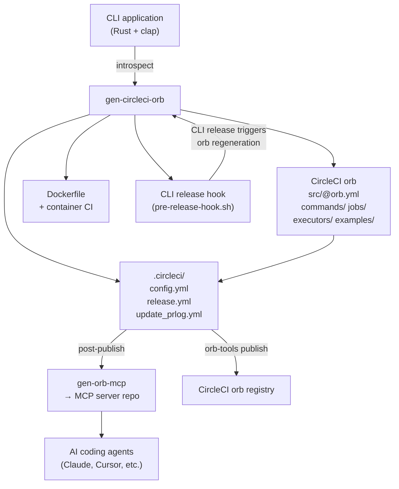
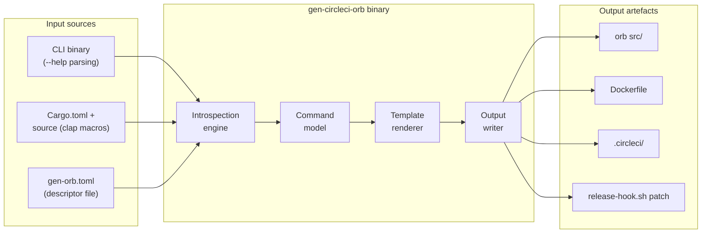

# gen-circleci-orb — Design Document

> Status: **DRAFT** — open questions listed at end; answers required before architecture is finalised.

---

## 1. Purpose

`gen-circleci-orb` is a CLI tool that takes an existing CLI application as input and generates the
full suite of CircleCI infrastructure needed to expose that application's commands as reusable
CircleCI orb jobs and commands.

The generated output includes:

| Artifact | Description |
|----------|-------------|
| CircleCI orb | An orb following CircleCI's standard template structure, with one job and one command per CLI subcommand |
| Docker container | A minimal execution environment image pre-installing the CLI binary, used as the orb executor |
| Orb CI pipeline | CircleCI config (3-file model) wiring the orb into its own test/publish release cycle |
| CLI release hook | Integration that triggers orb regeneration and republication on each new CLI release |
| MCP server | Invocation of `gen-orb-mcp` during the orb release to produce an MCP server that gives AI agents current orb knowledge and version-transition guidance |

The goal is that a developer with a working CLI tool can run `gen-circleci-orb` once and receive a
fully wired, production-ready CircleCI orb — including its container, CI pipeline, and AI agent
integration — with no manual CircleCI authoring required.

---

## 2. Motivation

Packaging a CLI tool as a CircleCI orb is repetitive work: every tool needs the same executor
definition, the same job/command boilerplate, the same container build pipeline, and the same
release wiring. The pattern is identical across tools; only the command names, parameters, and
binary name differ.

`gen-circleci-orb` eliminates this repetition by treating the orb as a derived artefact of the
CLI's own definition.

Secondary motivation: orbs published without a corresponding MCP server are invisible to AI coding
agents. By including `gen-orb-mcp` in the release chain, every generated orb ships with
first-class agent support from the first release.

---

## 3. High-Level Flow



---

## 4. Example Application

Consider `pcu` (Program Change Updater), a CLI with subcommands including `pr`, `push`,
`release`, and `linkedin`. A developer runs:

```bash
gen-circleci-orb --source ./pcu --output ./pcu-orb
```

`gen-circleci-orb` inspects `pcu`'s command structure and produces:

### 4.1 Generated orb job (example: `pr` subcommand)

```yaml
# pcu-orb/src/jobs/pr.yml
description: >
  Run pcu pr to update the pull-request log.
executor: default
parameters:
  verbosity:
    type: string
    default: ""
    description: "Verbosity flags (e.g. -vv)"
steps:
  - pcu/pr:
      verbosity: << parameters.verbosity >>
```

### 4.2 Generated orb command (example: `pr` subcommand)

```yaml
# pcu-orb/src/commands/pr.yml
description: Run pcu pr within a job step.
parameters:
  verbosity:
    type: string
    default: ""
steps:
  - run:
      name: pcu pr
      command: pcu << parameters.verbosity >> pr
```

### 4.3 Generated executor

```yaml
# pcu-orb/src/executors/default.yml
description: Docker image with pcu pre-installed.
docker:
  - image: jerusdp/pcu:<< parameters.tag >>
parameters:
  tag:
    type: string
    default: latest
```

### 4.4 Generated Dockerfile (container repo)

```dockerfile
FROM jerusdp/ci-rust:latest
RUN cargo binstall --no-confirm pcu
```

### 4.5 CLI release hook addition (`release-hook.sh` in pcu)

```bash
# Regenerate and stage updated orb after version bump
gen-circleci-orb --source . --output ../pcu-orb
git -C ../pcu-orb add -A
git -C ../pcu-orb commit -m "chore: regenerate orb for pcu v${NEW_VERSION}"
```

### 4.6 Orb release chain (simplified)

```
pcu release (cargo-release)
  └─ release-hook.sh
       └─ gen-circleci-orb (regenerate orb)
            └─ pcu-orb CI pipeline
                 └─ orb-tools publish → CircleCI registry
                      └─ gen-orb-mcp → MCP server published
```

---

## 5. Architecture Overview



### 5.1 Introspection engine

Reads the CLI application's command structure and produces a normalised `CommandModel` (see §6.1).
Three candidate strategies are described in §6.2; the chosen strategy determines what inputs
are required.

### 5.2 Command model

An intermediate representation capturing:

- Top-level binary name and description
- Subcommands (name, description, aliases)
- Per-subcommand arguments and flags (name, type, required/optional, default, description)
- Nesting depth (subcommands of subcommands)

### 5.3 Template renderer

Walks the `CommandModel` and renders:

- One `commands/<name>.yml` per subcommand
- One `jobs/<name>.yml` per subcommand
- `executors/default.yml`
- `@orb.yml` entry point
- `examples/` stubs
- `Dockerfile`
- `.circleci/config.yml`, `release.yml`, `update_prlog.yml`
- `release-hook.sh` snippet for the source CLI

### 5.4 Output writer

Writes files to the target directory, with configurable overwrite / diff / dry-run modes.

---

## 6. Detailed Design — Open Options

### 6.1 CLI introspection strategy

Three strategies are under consideration. Each has different trade-offs for accuracy, portability,
and dependency burden.

#### Option A — Binary execution + `--help` parsing

Execute the CLI binary with `--help` and each subcommand's `--help`, then parse the output.

```
gen-circleci-orb --binary ./target/release/pcu
```

**Pros:** Works for any CLI regardless of language or build system; no source access needed.  
**Cons:** Output format varies between clap versions and custom help formatters; fragile to style
changes; requires a compiled binary.

#### Option B — Source + clap derive macro analysis

Parse `Cargo.toml` for the binary name/version and walk source files to extract clap `#[derive(Parser)]`
and `#[derive(Subcommand)]` types via `syn`.

```
gen-circleci-orb --source ./pcu
```

**Pros:** Accurate, stable, no binary required; can extract types and doc comments directly.  
**Cons:** Rust-only; requires `syn` parsing of potentially complex macro expansions; sensitive to
clap API versions.

#### Option C — Descriptor file (`gen-orb.toml`)

The CLI author maintains a `gen-orb.toml` alongside their `Cargo.toml` that explicitly declares
the commands and parameters to expose.

```toml
[orb]
namespace = "jerus-org"
name = "pcu"

[[command]]
name = "pr"
description = "Update pull-request log"

[[command.parameter]]
name = "verbosity"
type = "string"
default = ""
```

**Pros:** Explicit, stable, language-agnostic; author controls exactly what is exposed.  
**Cons:** Manual maintenance burden; can drift from the actual CLI.

#### Option D — Hybrid (B primary, C override)

Use Option B as the default introspection path, with `gen-orb.toml` available to override or
supplement auto-detected values where macro analysis is insufficient.

### 6.2 Subcommand → orb element mapping

How CLI subcommands map to orb elements:

| CLI element | Orb element | Notes |
|-------------|-------------|-------|
| Binary | Executor, orb name | One executor named `default` |
| Subcommand | Job + Command pair | Job wraps checkout + command invocation |
| Flag `--foo` | orb parameter `foo` | Type inferred from clap type annotation |
| Required arg | orb parameter, `required: true` (enum step) | |
| Nested subcommand | Separate job/command with `parent_child` naming | Depth limit TBD |

**Open question:** Should nested subcommands (e.g. `pcu release version`) become flat orb names
(`release_version`) or should nesting be represented differently?

### 6.3 Docker container scope

Three options for the generated execution environment:

| Option | Description | Complexity |
|--------|-------------|------------|
| **A — Binstall at runtime** | Orb executor uses base `jerusdp/ci-rust` and installs the binary via `cargo binstall` at job start | Low — no separate container repo |
| **B — Dedicated container repo** | gen-circleci-orb scaffolds a full container repo (Dockerfile + CI) pinned to the CLI binary | High — requires separate repo + publish pipeline |
| **C — Generated Dockerfile, no repo** | gen-circleci-orb writes a Dockerfile into the orb repo; the orb CI builds and pushes it | Medium |

Option A is the simplest starting point but adds install time to every CI job. Options B and C
produce faster jobs at the cost of a container build/publish pipeline.

### 6.4 Release integration depth

How tightly does gen-circleci-orb integrate with the source CLI's release process?

| Level | Description |
|-------|-------------|
| **1 — Manual** | gen-circleci-orb is a one-shot scaffold tool; the user re-runs it manually when the CLI changes |
| **2 — Hook snippet** | gen-circleci-orb emits a `release-hook.sh` snippet the user adds to the CLI's release hook; regeneration is automatic on CLI release |
| **3 — Full wiring** | gen-circleci-orb modifies the CLI's `release.toml` and `release-hook.sh` in-place to add the regeneration step |

### 6.5 MCP server generation placement

`gen-orb-mcp` produces an MCP server from an orb definition. Where in the pipeline does it run?

| Option | Trigger point | Notes |
|--------|--------------|-------|
| **A — Post orb publish** | After `orb-tools publish` succeeds in the orb's release CI | MCP always reflects latest published version |
| **B — Pre orb publish** | As part of the orb release commit (pre-release hook) | MCP source is committed alongside orb source |
| **C — Separate pipeline** | Triggered by the orb's GitHub release event | Decoupled; can be retried independently |

---

## 7. Open Questions

The following questions must be answered before the architecture can be finalised:

1. **Introspection strategy** — Which of Options A–D (§6.1) is preferred? The hybrid approach (D)
   is recommended as the default but requires confirming that clap derive macro analysis via `syn`
   is in scope.

2. **Nested subcommands** — How should deeply nested subcommands (e.g. `pcu release version`) be
   named in the generated orb? Flat (`release_version`) or structured?

3. **Container strategy** — Should the orb use runtime binstall (Option A, simpler) or a
   dedicated container (Options B/C, faster jobs)? Is the container expected to be versioned in
   lock-step with the CLI binary?

4. **Release integration depth** — Is full in-place wiring (Level 3) acceptable, or should the
   tool stop at emitting a snippet (Level 2) and leave the user to integrate it?

5. **MCP server placement** — Should `gen-orb-mcp` run as part of the orb's release CI (Option A)
   or be committed alongside the orb source (Option B)?

6. **Orb namespace** — Is the generated orb always published under the source CLI's GitHub org
   namespace (e.g. `jerus-org/pcu`), or is the namespace configurable?

7. **Target CLI language** — Is gen-circleci-orb intended only for Rust/clap CLIs, or should it
   support any CLI binary (via `--help` parsing) from the outset?

8. **Regeneration granularity** — Should regeneration be all-or-nothing (replace all orb files) or
   diff-aware (only update files whose content has changed, to minimise noisy commits)?

9. **Orb template conformance** — CircleCI's "default template" includes a `@orb.yml` entry point,
   `src/commands/`, `src/jobs/`, `src/executors/`, `src/examples/`, and an `orb-tools` publish
   pipeline. Is there a specific version of the orb-tools pipeline or template to target?

10. **First target CLI** — Is `gen-circleci-orb` itself the first target (dogfooding), or is
    another CLI (e.g. `pcu`, `gen-changelog`) the primary validation case?
