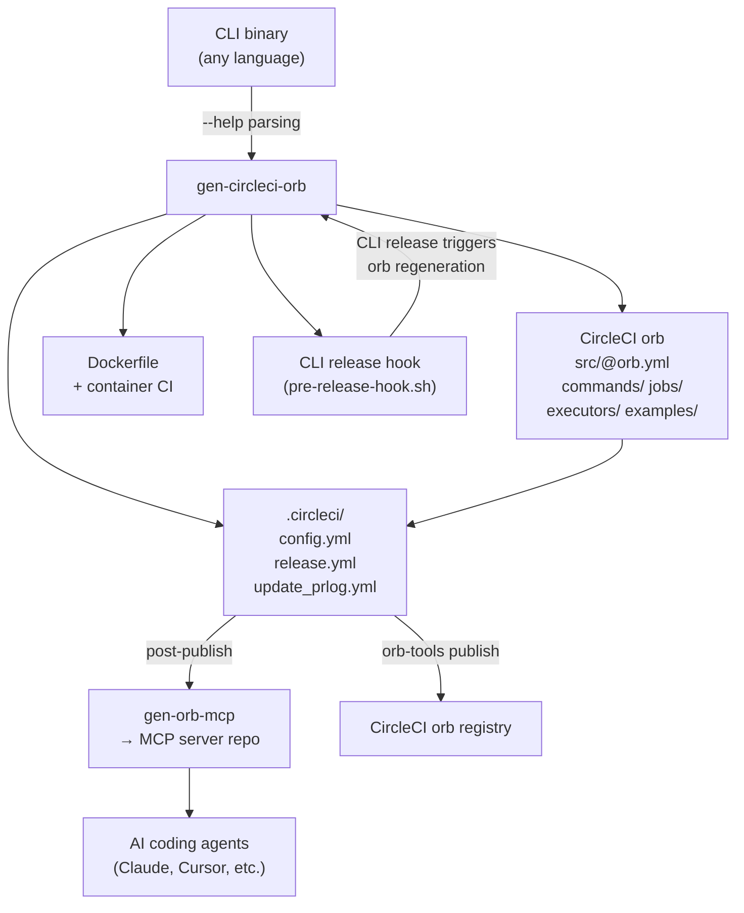
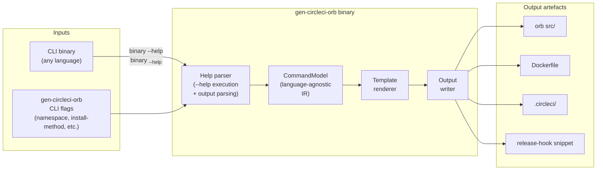

# gen-circleci-orb — Design Document

> Status: **DRAFT** — open questions listed at end; answers required before architecture is finalised.

---

## 1. Purpose

`gen-circleci-orb` is a CLI tool that takes an existing CLI application as input and generates the
full suite of CircleCI infrastructure needed to expose that application's commands as reusable
CircleCI orb jobs and commands.

The generated output includes:

| Artifact | Description |
|----------|-------------|
| CircleCI orb | An orb following CircleCI's standard template structure, with one job and one command per CLI subcommand |
| Docker container | A minimal execution environment image pre-installing the CLI binary, used as the orb executor |
| Orb CI pipeline | CircleCI config (3-file model) wiring the orb into its own test/publish release cycle |
| CLI release hook | Integration that triggers orb regeneration and republication on each new CLI release |
| MCP server | Invocation of `gen-orb-mcp` during the orb release to produce an MCP server that gives AI agents current orb knowledge and version-transition guidance |

The goal is that a developer with a working CLI tool can run `gen-circleci-orb` once and receive a
fully wired, production-ready CircleCI orb — including its container, CI pipeline, and AI agent
integration — with no manual CircleCI authoring required.

The tool makes no assumptions about the source language or build system of the target CLI. Its
only requirement is a runnable binary. It is equally suited to first-party tools (run as part of
the tool's own build pipeline) and third-party tools (where only a binary is available).

---

## 2. Motivation

Packaging a CLI tool as a CircleCI orb is repetitive work: every tool needs the same executor
definition, the same job/command boilerplate, the same container build pipeline, and the same
release wiring. The pattern is identical across tools; only the command names, parameters, and
binary name differ.

`gen-circleci-orb` eliminates this repetition by treating the orb as a derived artefact of the
CLI's own `--help` output.

Secondary motivation: orbs published without a corresponding MCP server are invisible to AI coding
agents. By including `gen-orb-mcp` in the release chain, every generated orb ships with
first-class agent support from the first release.

---

## 3. High-Level Flow



---

## 4. Example Application

`gen-orb-mcp` is a CLI tool that generates MCP servers from CircleCI orb definitions. It has five
subcommands discovered by running `gen-orb-mcp --help`:

```
Commands:
  generate  Generate an MCP server from an orb definition
  validate  Validate an orb definition without generating
  diff      Compute conformance rules by diffing two orb versions
  migrate   Apply conformance-based migration to a consumer's .circleci/ directory
  prime     Populate prior-versions/ and migrations/ from git history
```

A developer wanting to expose `gen-orb-mcp` via CircleCI runs:

```bash
gen-circleci-orb generate \
  --binary gen-orb-mcp \
  --namespace jerus-org \
  --output ./gen-orb-mcp-orb
```

`gen-circleci-orb` executes `gen-orb-mcp --help`, `gen-orb-mcp generate --help`,
`gen-orb-mcp validate --help`, etc., parses the output, and produces:

### 4.1 Generated orb entry point

```yaml
# gen-orb-mcp-orb/src/@orb.yml
version: 2.1
description: >
  Generate MCP servers from CircleCI orb definitions.
display:
  home_url: https://github.com/jerus-org/gen-orb-mcp
  source_url: https://github.com/jerus-org/gen-orb-mcp-orb
commands:
  generate: { ref: "commands/generate.yml" }
  validate: { ref: "commands/validate.yml" }
  diff:     { ref: "commands/diff.yml" }
  migrate:  { ref: "commands/migrate.yml" }
  prime:    { ref: "commands/prime.yml" }
jobs:
  generate: { ref: "jobs/generate.yml" }
  validate: { ref: "jobs/validate.yml" }
  diff:     { ref: "jobs/diff.yml" }
  migrate:  { ref: "jobs/migrate.yml" }
  prime:    { ref: "jobs/prime.yml" }
executors:
  default: { ref: "executors/default.yml" }
```

### 4.2 Generated orb command (example: `generate`)

Derived from `gen-orb-mcp generate --help` output:

```yaml
# gen-orb-mcp-orb/src/commands/generate.yml
description: Generate an MCP server from an orb definition.
parameters:
  orb_path:
    type: string
    description: "Path to the orb YAML file (e.g., src/@orb.yml)"
  output:
    type: string
    default: "./dist"
    description: "Output directory for generated server"
  format:
    type: enum
    default: "source"
    enum: ["binary", "source"]
    description: "Output format"
  name:
    type: string
    default: ""
    description: "Name for the generated orb server (defaults to filename)"
  version:
    type: string
    default: ""
    description: "Version for the generated MCP server crate"
  force:
    type: boolean
    default: false
    description: "Overwrite existing files without confirmation"
  migrations:
    type: string
    default: ""
    description: "Directory containing conformance rule JSON files to embed"
  prior_versions:
    type: string
    default: ""
    description: "Directory of prior orb version YAML snapshots to embed"
  tag_prefix:
    type: string
    default: "v"
    description: "Tag prefix used to discover the orb version from git tags"
steps:
  - run:
      name: gen-orb-mcp generate
      command: |
        gen-orb-mcp generate \
          --orb-path "<< parameters.orb_path >>" \
          --output "<< parameters.output >>" \
          --format "<< parameters.format >>" \
          <<# parameters.name >>--name "<< parameters.name >>"<</ parameters.name >> \
          <<# parameters.version >>--version "<< parameters.version >>"<</ parameters.version >> \
          <<# parameters.force >>--force<</ parameters.force >> \
          <<# parameters.migrations >>--migrations "<< parameters.migrations >>"<</ parameters.migrations >> \
          <<# parameters.prior_versions >>--prior-versions "<< parameters.prior_versions >>"<</ parameters.prior_versions >>
```

### 4.3 Generated orb job (example: `generate`)

```yaml
# gen-orb-mcp-orb/src/jobs/generate.yml
description: Run gen-orb-mcp generate in a dedicated job.
executor: default
parameters:
  orb_path:
    type: string
  output:
    type: string
    default: "./dist"
  # ... same parameters as command ...
steps:
  - checkout
  - generate:
      orb_path: << parameters.orb_path >>
      output: << parameters.output >>
```

### 4.4 Generated executor

```yaml
# gen-orb-mcp-orb/src/executors/default.yml
description: Execution environment with gen-orb-mcp pre-installed.
docker:
  - image: jerusdp/gen-orb-mcp:<< parameters.tag >>
parameters:
  tag:
    type: string
    default: latest
```

### 4.5 Generated Dockerfile

```dockerfile
FROM ubuntu:24.04
# Install gen-orb-mcp — install method selected at generation time (see §6.3)
RUN cargo binstall --no-confirm gen-orb-mcp
```

### 4.6 Orb release chain

```
gen-orb-mcp release (cargo-release)
  └─ release-hook.sh
       └─ gen-circleci-orb generate --binary gen-orb-mcp (regenerate orb)
            └─ gen-orb-mcp-orb CI pipeline
                 └─ orb-tools publish → jerus-org/gen-orb-mcp in CircleCI registry
                      └─ gen-orb-mcp prime + generate → MCP server updated
```

---

## 5. Architecture Overview



### 5.1 Help parser

Executes the target binary with `--help` to obtain the top-level command list and description,
then executes `<binary> <subcommand> --help` for each discovered subcommand to collect parameters.
Produces a normalised `CommandModel` regardless of the source CLI's language or build system.

### 5.2 CommandModel

A language-agnostic intermediate representation capturing:

- Binary name and top-level description
- Subcommands: name, description, aliases
- Per-subcommand parameters: long flag name, short alias, type hint, default value,
  required/optional, possible values (for enum inference), description text
- Nesting: subcommands that themselves have subcommands

### 5.3 Template renderer

Walks the `CommandModel` and renders:

- `src/commands/<name>.yml` — one per subcommand
- `src/jobs/<name>.yml` — one per subcommand
- `src/executors/default.yml`
- `src/@orb.yml` entry point
- `src/examples/` stubs
- `Dockerfile` (install method determined by CLI flag, see §6.3)
- `.circleci/config.yml`, `release.yml`, `update_prlog.yml`
- Release hook snippet

### 5.4 Output writer

Writes files to the target directory. Supports `--dry-run` (print without writing) and
diff-aware mode (skip files whose rendered content is unchanged, to avoid noisy commits).

---

## 6. Detailed Design — Open Options

### 6.1 Parameter type inference

When parsing `--flag <VALUE>` from help output, how is the CircleCI parameter type determined?

| Signal | Inferred type | Example |
|--------|--------------|---------|
| `[possible values: a, b]` present in help | `enum` | `--format <FORMAT>` with `[possible values: binary, source]` |
| Flag has no value (presence-only) | `boolean` | `--dry-run`, `--force` |
| Metavar is `<PATH>`, `<DIR>`, `<FILE>` | `string` | `--output <OUTPUT>` |
| Metavar is `<N>` or contains "count" | `integer` | (if present) |
| All others | `string` | default safe fallback |

Clap's standard `--help` output reliably includes `[possible values: ...]` for enums and omits
value metavars for boolean flags, making these inferences stable.

### 6.2 Nested subcommands

Some CLIs have subcommands nested more than one level deep (e.g. `gen-orb-mcp` itself is flat,
but a tool might have `tool server start`). Options:

| Option | Orb name | Example |
|--------|----------|---------|
| **A — Flat with separator** | `parent_child` | `server_start` |
| **B — Depth limit 1** | Only top-level subcommands exposed; nested levels become parameters | `server` with `action: enum [start, stop]` |
| **C — Recursive** | Full nesting represented as separate jobs/commands | `server`, `server_start`, `server_stop` |

Option A is simplest and consistent with CircleCI naming conventions.

### 6.3 Container binary installation method

The generated Dockerfile must install the target CLI binary. Since the tool may not be a Rust
crate, the installation method must be configurable via a `gen-circleci-orb` CLI flag. Three
primary options:

| Option | CLI flag | Generated Dockerfile snippet | Constraints |
|--------|----------|------------------------------|-------------|
| **A — cargo binstall** | `--install-method binstall` | `RUN cargo binstall --no-confirm <name>` | Binary must be on crates.io with binstall metadata |
| **B — GitHub release download** | `--install-method github-release` | `RUN curl -L <release-url> \| tar xz ...` | Requires knowing asset naming convention; version must be parameterised |
| **C — User-supplied script** | `--install-script ./install.sh` | `COPY install.sh /tmp/ && RUN /tmp/install.sh` | Maximum flexibility; user responsible for correctness |

A fourth option — **D, auto-detect** — could attempt binstall first, then fall back to GitHub
releases, then prompt, but this adds complexity and may produce incorrect results silently.

The default recommendation is Option A for first-party Rust tools (the primary expected use case)
with Option C as the escape hatch for third-party or non-Rust binaries.

**Separately: container scope.** Does gen-circleci-orb generate a full container repo (separate
GitHub repo + publish CI) or embed the Dockerfile in the orb repo and build it there?

| Scope | Description | Complexity |
|-------|-------------|------------|
| **Embedded** | Dockerfile lives in the orb repo; orb CI builds and pushes on each release | Medium |
| **Separate repo** | gen-circleci-orb scaffolds a dedicated container repo with its own CI | High — two repos to manage |
| **Runtime install** | No container build at all; orb executor uses a base image and installs at job start | Low — slow jobs |

### 6.4 Release integration depth

| Level | Description |
|-------|-------------|
| **1 — Manual** | One-shot scaffold; user re-runs gen-circleci-orb manually when CLI changes |
| **2 — Snippet** | Tool emits a `release-hook.sh` snippet the user adds to the CLI's hook |
| **3 — Full wiring** | Tool modifies the CLI's `release.toml` and `release-hook.sh` in-place |

Level 3 requires write access to the source CLI's repo and knowledge of its release tooling
(cargo-release, etc.). Level 2 is safe and language-agnostic.

### 6.5 MCP server generation placement

| Option | Trigger | Notes |
|--------|---------|-------|
| **A — Post orb publish** | After `orb-tools publish` in orb release CI | MCP always reflects latest published version |
| **B — Pre orb publish** | Orb release pre-release hook; MCP source committed | MCP source versioned alongside orb |
| **C — Separate pipeline** | Triggered by orb's GitHub release event | Decoupled; independently retriable |

---

## 7. Open Questions

1. **Nested subcommand representation** — For CLIs with multi-level nesting, should the orb use
   flat `parent_child` names (Option A), cap at depth 1 with an action enum (Option B), or
   generate recursive job/command sets (Option C)?

2. **Container installation method** — What should the default `--install-method` be, and should
   auto-detect (try binstall, fall back to GitHub release) be attempted? What is the expected
   primary use case: first-party Rust tools or arbitrary third-party binaries?

3. **Container scope** — Should the Dockerfile be embedded in the orb repo (simpler, one repo)
   or scaffolded into a separate dedicated container repo (matches the pattern used by
   `ci-container` and `zola-container`)?

4. **Release integration depth** — Level 2 (snippet) is safe and language-agnostic. Is Level 3
   (full in-place wiring) desired for the first-party case, or is manual integration of the
   snippet acceptable?

5. **MCP server placement** — Option A (post orb publish in CI) keeps the MCP current but
   requires the orb release CI to have credentials for the MCP repo. Option B commits the MCP
   source alongside the orb, making it reviewable but adding pre-release complexity. Preference?

6. **Orb namespace** — Should the namespace default to the GitHub org of the repository where
   gen-circleci-orb is run (auto-detected from `git remote`), or always require an explicit
   `--namespace` flag?

7. **Regeneration granularity** — All-or-nothing (overwrite all files each run) or diff-aware
   (only write files whose content has changed)? Diff-aware reduces noise but increases
   complexity.

8. **orb-tools version** — Which version of `circleci/orb-tools` should the generated CI
   pipeline target? Should it be hardcoded or passed as a parameter to gen-circleci-orb?

9. **Help format portability** — The parser is designed around clap's `--help` output format
   (which is stable and well-structured). Should a best-effort mode exist for non-clap CLIs
   with less structured help, or is clap-compatible output a hard prerequisite?

10. **First validation target** — Is `gen-circleci-orb` itself (dogfooding on its own `generate`
    subcommand) or `gen-orb-mcp` the primary validation case for the first implementation?
